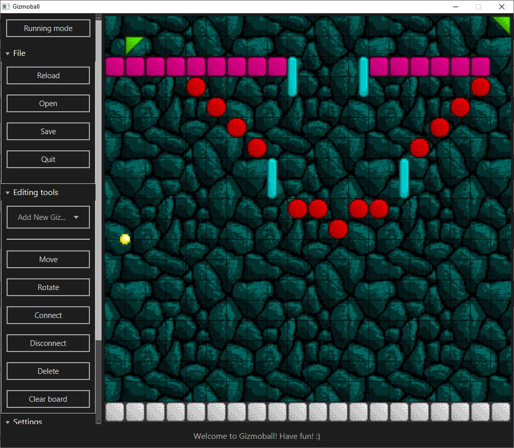
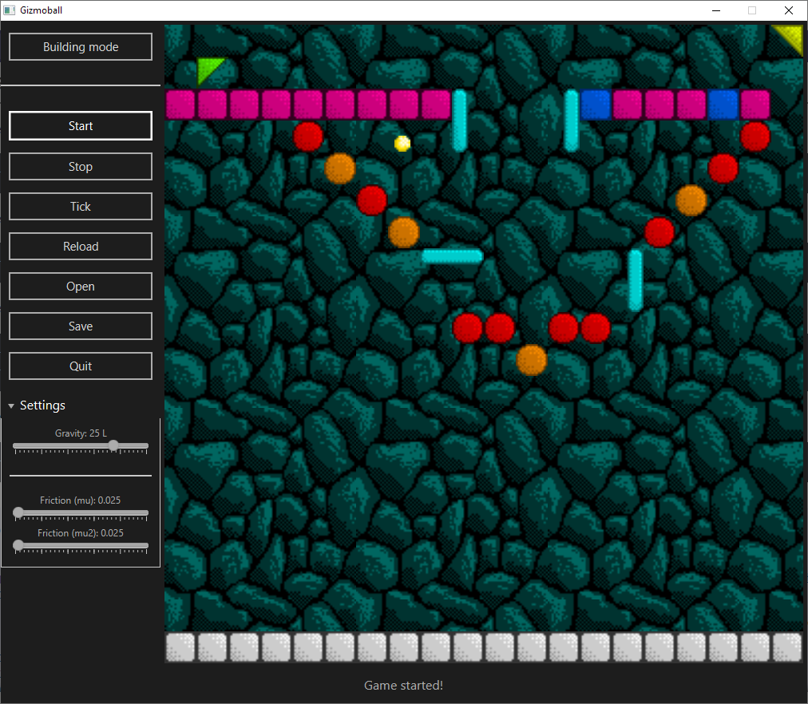
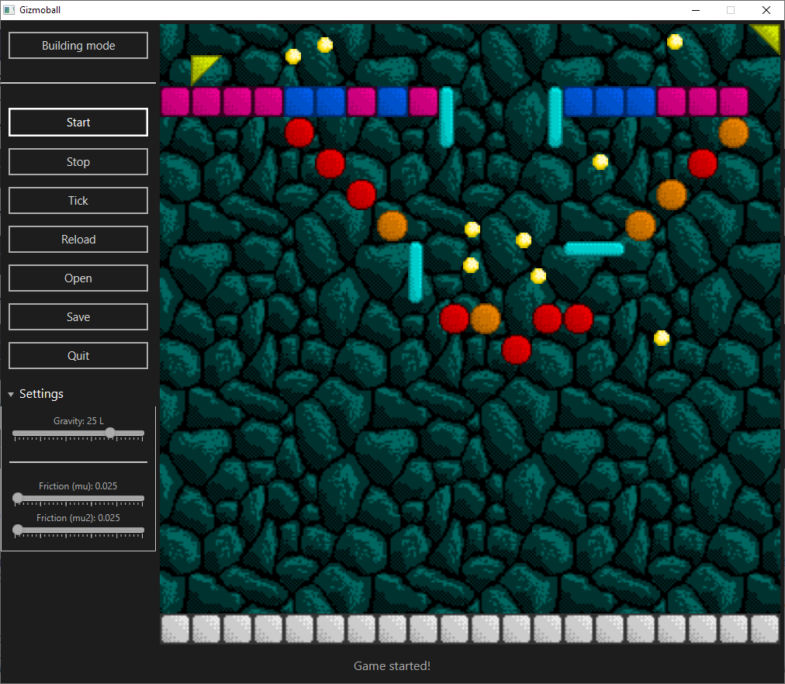

# Gizmoball

An implementation of a university 3rd year group coursework assignment, a sandbox Pinball like game with an editor.

## Features
* Cool physics engine
* Real-time control over gravity and friction
* Colourful pixel art
* Powerfull level editor
* Save/load levels easily
* Insane trigger system

## Gifs

## Screenshots

